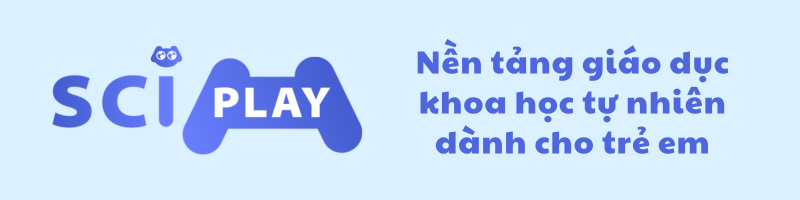
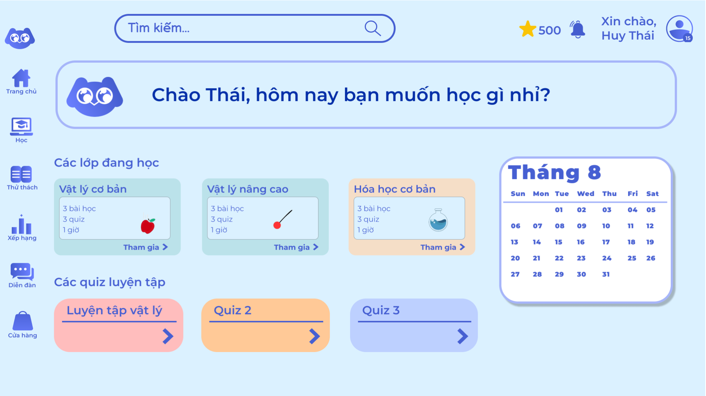
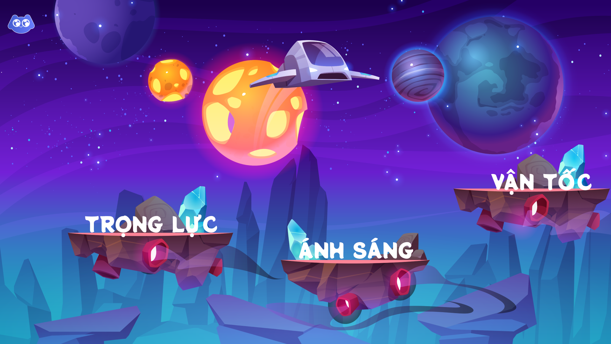
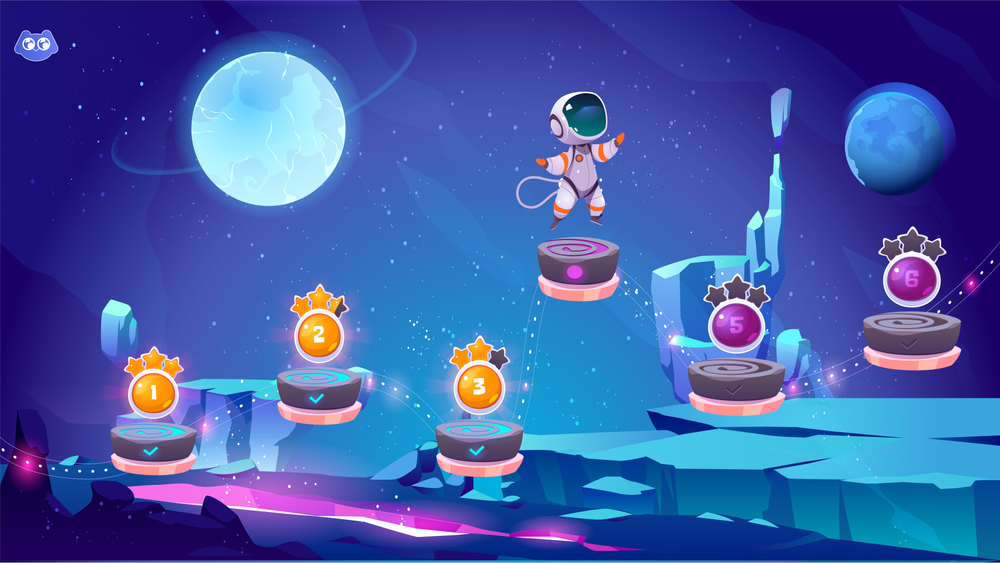
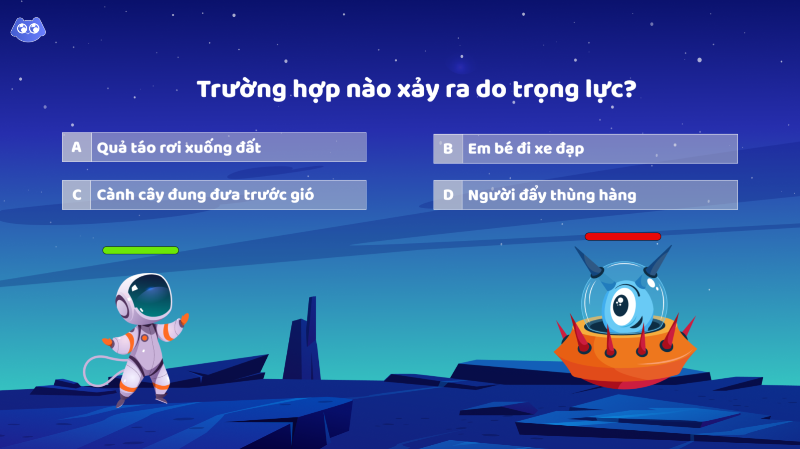
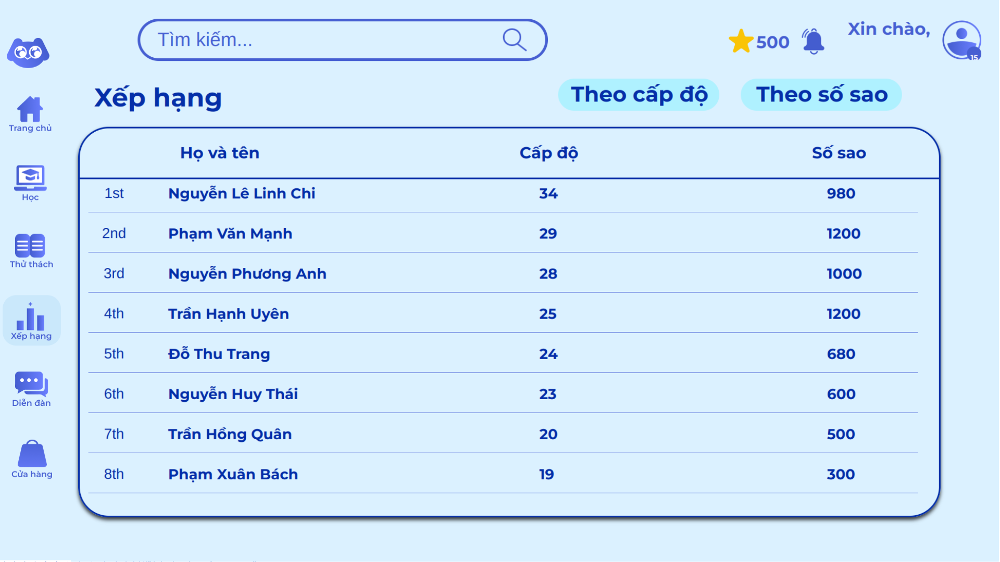
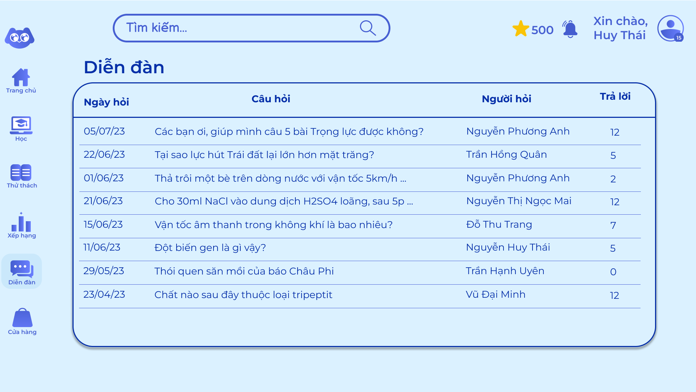
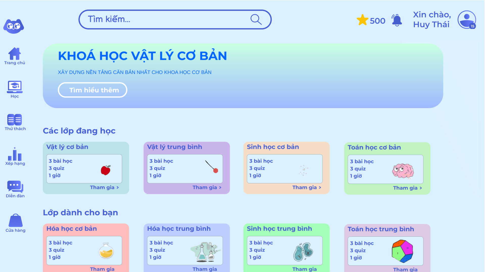

# SciPlay

 

## Mục lục
* [Giới thiệu](#gioi-thieu)
* [Tính năng](#tinh-nang)
* [Công nghệ](#cong-nghe)
* [Nhóm tác giả](#nhom-tac-gia)

## Giới thiệu

Như chúng ta đã biết, khoa học tự nhiên là phần kiến thức vô cùng quan trọng đối với sự nhận thức và phát triển của mỗi con người. Đặc biệt là ở giai đoạn trẻ em chính là khoảng thời gian vô cùng phù hợp để có thể bồi đắp những kiến thức bổ ích & cần thiết trong cuộc sống hay niềm say mê với khoa học.

Ngoài việc học tập ở trường, nơi đã cung cấp những kiến thức căn bản về khoa học, khi về nhà các bạn trẻ dường như đang chưa có quá nhiều cơ hội được thực hành, trải nghiệm, hay tự khám phá thế giới khoa học mênh mông kỳ thú.

Nền tảng giáo dục khoa học tự nhiên cho trẻ em - SciPlay hướng đến việc mang lại một trải nghiệm học tập mới lạ cho trẻ thông qua bài học được thiết kế dưới dạng trò chơi tương tác, nơi các bạn được đóng vai các hiệp sĩ có thể cùng những người bạn của mình phiêu du, khám phá vũ trụ khoa học bao la rộng lớn từ đó cũng có được những hiểu biết vô cùng thực tế về thế giới xung quanh.

## Tính năng
 

### Học tập
Các môn học được thiết kế và phân thành nhiều khóa học khác nhau, mỗi khóa như một hành tinh với nhiều **Đảo kiến thức**. Trên mỗi đảo là một phần kiến thức của khóa học đó bao gồm các bài học phù hợp dành cho học sinh được thiết kế dưới các dạng:
- **Interactive story**: Bài học lý thuyết mang tính tương tác, kiến thức được nhân vật trong trò chơi truyền tải qua cuộc đối thoại với nhân vật giáo viên ảo.
- **Quiz**: Các câu hỏi trắc nghiệm để kiểm tra kiến thức. Với mỗi câu, trong khoảng thời gian người học phải chọn được đáp án đúng và sẽ nhận được kết quả & phần giải thích.
- **Flashcard**: Học các định nghĩa thông qua thẻ ghi nhớ. Người học sẽ có thể điểm qua lại những khái niệm quan trọng nằm trong những bài học trong khóa.
- **Video**: Video bài giảng được đội ngũ giảng viên của hệ thống trực tiếp biên soạn và giảng dạy.

  

    
  

  

    
  

### Thử thách
Dựa trên thử thách được công bố vào mỗi sự kiện đặc biệt hoặc cuối tuần, các bạn học sinh sẽ có thể đóng vai những hiệp sĩ ở trên hòn đảo mang tên Sci-Island, cùng nhau bảo vệ hòn đảo khỏi những tên quái vật đang tiến vào từ ngoài không gian bằng cách trả lời thật nhiều câu hỏi về các kiến thức đã học.

### Xếp hạng
Các bạn học có thể tích lũy kinh nghiệm, số sao đạt được và số giờ học để đua top với những người chơi khác trên hệ thống và cả những người bạn cùng lớp của mình, từ đó tạo nên động lực và khuyến khích các bạn học tập nhiều hơn.

### Diễn đàn
Các bạn học có thể tham gia giao lưu, làm quen với nhau hay trao đổi về những câu hỏi, bài giảng, những bài tập khó. Đội ngũ thầy cô của hệ thống sẽ tham gia giải đáp và hỗ trợ các bạn học sinh còn muốn hỏi thêm về các bài giảng hay có những câu hỏi khó còn thắc mắc.

### Hệ tư vấn khóa học

Dựa trên các khóa học các bạn học sinh đã hoàn thành, nền tảng sẽ có một hệ thống tư vấn dựa trên các yếu tố tương đồng như: độ khó, độ khoa học hay độ hot của các khóa học để suggest cho từng bạn những khóa học phù hợp nhất với bản thân, từ đó có được lộ trình học tập hiệu quả.

### Cửa hàng
Nơi các bạn học sinh có thể sử dụng tiền ảo nhận được sau khi hoàn thành bài học hay thử thách để thỏa sức trang trí, nâng cấp cho trang cá nhân và nhân vật ảo của mình, kích thích tính cá nhân hóa và tăng sự thú vị cho quá trình học tập.

## Công nghệ
Những công nghệ được sử dụng trong quá trình phát triển dự án:
- **Frontend**: React.js
- **Backend**: Node & Express.js
- **Database**: Google Cloud Storage & BigQuery
- **Deployment**: Vercel

## Nhóm tác giả
**Team Lowlkeys** - năm thành viên vô cùng năng động đến từ khoa Công nghệ Thông tin, trường Đại học Công nghệ, Đại học Quốc gia Hà Nội.
- [Nguyễn Huy Thái](https://www.facebook.com/huythai855/), sinh viên năm hai, ngành Công nghệ thông tin.
- [Trần Hồng Quân](https://www.facebook.com/hongquant.17), sinh viên năm hai, ngành Công nghệ thông tin.
- [Nguyễn Phương Anh](https://www.facebook.com/nphg4nh), sinh viên năm nhất ngành Khoa học máy tính.
- [Nguyễn Thị Ngọc Mai](https://www.facebook.com/apl.mai24), sinh viên năm nhất ngành Mạng máy tính và truyền thông dữ liệu.

- [Đỗ Thu Trang](https://www.facebook.com/profile.php?id=100025297746130), sinh viên năm nhất ngành Công nghệ thông tin định hướng thị trường Nhật Bản.